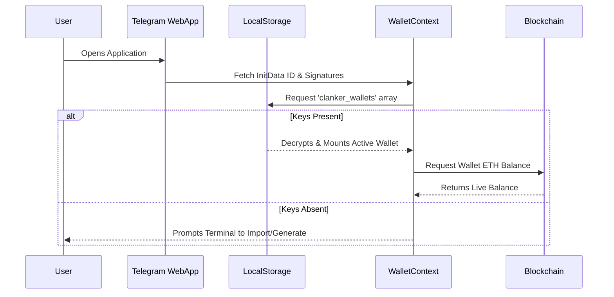
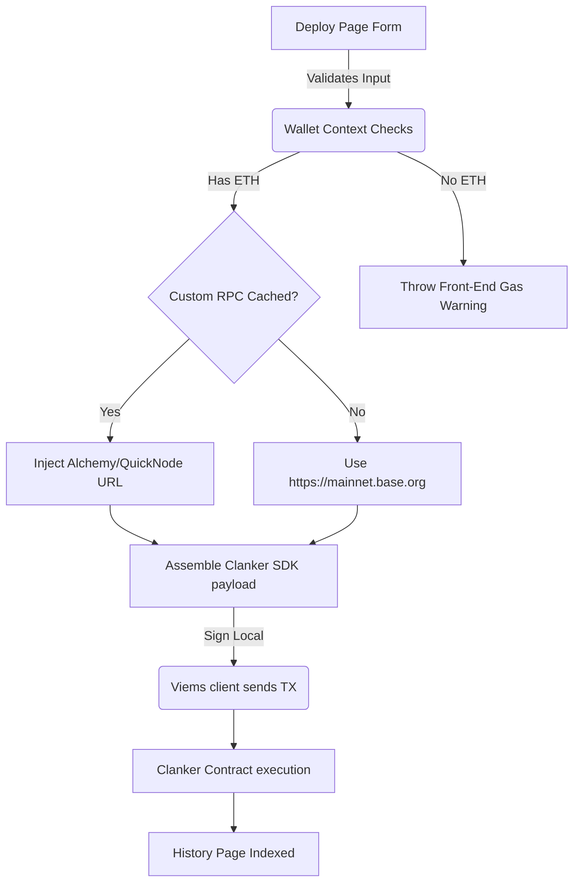

# Application Visual Flow & Architecture

This application operates as a Serverless Next.js Application wrapping the Telegram Web App ecosystem. It interacts heavily with localized zero-knowledge states, communicating solely with the Base Blockchain layer strictly via client-side API derivations. 

## Component Workflows

### 1. Authentication & Security Pipeline

### 2. Deployment Processing 

## System Modules
*   `contexts/WalletContext.tsx`: The heart of the application. Secures multi-wallet logic locally, processes Viem initialization dynamically based on Custom RPC overrides, and polls live balances.
*   `app/api/deploy/route.ts`: A secondary fallback integration for server-side relays when strict local derivations are unfavorable.
*   `lib/clanker/config.ts`: Modifies pool sizes, custom BPS static fees, and extracts Telegram user environments before interacting with Clankers API definitions.
